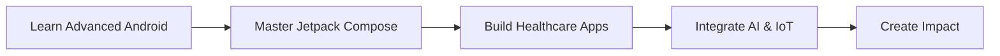

<div align="center">
  
# 👋 Xin chào, mình là Mai Nguyễn Đăng Khoa!

### 📱 Junior Android Developer | Mobile-First Engineer

[](https://git.io/typing-svg)

</div>

---

## 🚀 Về mình

```kotlin
val developer = Developer(
    name = "Mai Nguyễn Đăng Khoa",
    role = "Junior Android Developer",
    currentFocus = "HealthCare Ecosystems & IoT Integrations",
    learning = listOf("Advanced Android Architecture", "3D Rendering (SceneView)"),
    passion = "Building seamless mobile experiences"
)
```

🎓 **Sinh viên IT năm cuối** với niềm đam mê xây dựng trải nghiệm mobile mượt mà bằng **Kotlin** và **Jetpack Compose**

💡 **Background đa dạng**: Từ Full-stack Development đến Team Leadership, kết nối giữa hệ thống backend phức tạp và giao diện mobile thân thiện

⚡ **Fun fact**: Kinh nghiệm từ Game Dev đến IoT Hardware giúp mình tối ưu hiệu suất app và xử lý hardware sensors hiệu quả

---

## 🛠️ Tech Stack

<details open>
<summary><b>📱 Mobile Development</b></summary>
<br>


</details>

<details>
<summary><b>⚙️ Backend Development</b></summary>
<br>


</details>

<details>
<summary><b>🌐 Web Development</b></summary>
<br>


</details>

<details>
<summary><b>🎮 Game Development</b></summary>
<br>


</details>

<details>
<summary><b>🔌 IoT Development</b></summary>
<br>


</details>

<details>
<summary><b>🤖 AI & Others</b></summary>
<br>


</details>

---

## 📊 GitHub Analytics

<div align="center">
  
  
</div>

<div align="center">
  
</div>

---

## 🏆 Dự Án Nổi Bật

<table>
<tr>
<td width="50%">

### 🏥 HelloDoc
**Team Leader & Full-stack Developer**

Ứng dụng diễn đàn sức khỏe & đặt lịch bác sĩ toàn diện, hỗ trợ người khuyết tật

**Highlights:**
- 🤟 Dịch ngôn ngữ ký hiệu 3D
- 🤖 Tích hợp AI
- ♿ Accessibility-first design

</td>
<td width="50%">

### 🅿️ Parking System
**PM & Android Developer**

App quản lý bãi đỗ xe mobile với rapid-prototype

**Highlights:**
- ⚡ Sprint 2 tuần Agile
- 📱 Modern Android Architecture
- 🎯 Real-time parking status

</td>
</tr>

<tr>
<td width="50%">

### 💬 IT Forum
**Team Leader**

Diễn đàn học thuật với monitoring stability

**Highlights:**
- 📊 Firebase Analytics
- 🐛 Crashlytics Integration
- 👥 Community-driven features

</td>
<td width="50%">

### 🚀 More Projects Coming...

Đang nghiên cứu và phát triển thêm nhiều dự án thú vị!

**Areas of Interest:**
- Healthcare Tech
- IoT Integration
- AI-powered Apps

</td>
</tr>
</table>

---

## 📈 Contribution Graph

<div align="center">
  
</div>

---

## 🎯 Current Goals



---

## 📫 Kết Nối Với Mình

<div align="center">

[](mailto:maikhoa2015@gmail.com)
[](https://github.com/MaiKhoa0101)
[](#)

</div>

---

<div align="center">
  
### 💭 Quote of the Day


### 👀 Profile Views


---

**⭐️ From [MaiKhoa0101](https://github.com/MaiKhoa0101) with 💙**

</div>
